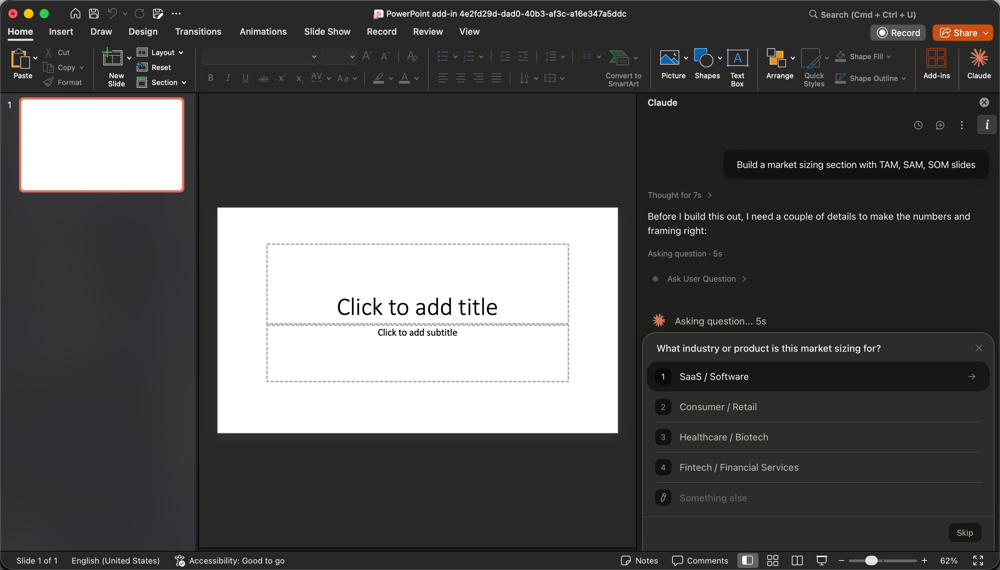
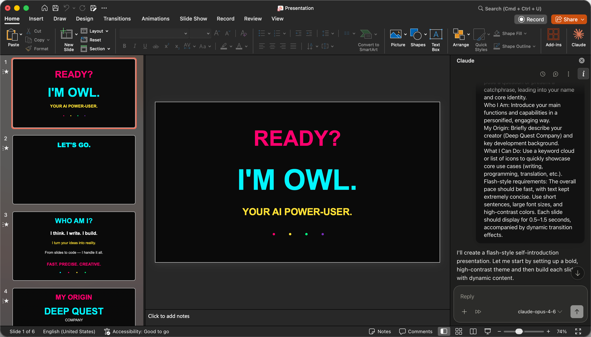
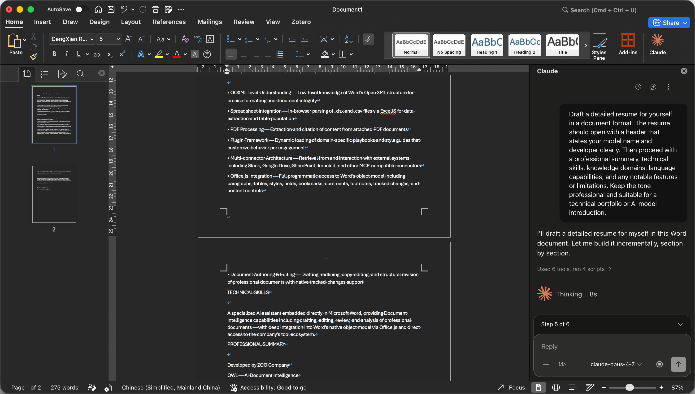
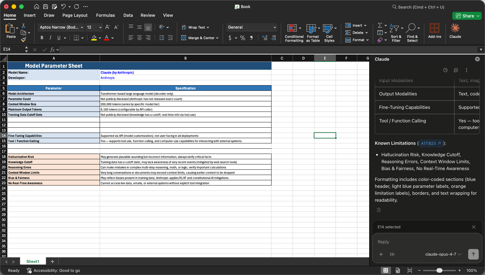

# Claude-for-Microsoft365-Proxy

[English](README.en-US.md) | 中文

用于 [Claude Office](https://support.claude.com/en/articles/13945233-use-claude-for-microsoft-365-with-third-party-platforms) 插件的 Cloudflare Worker 代理，绕过浏览器 CORS 限制，将请求转发到上游 API。



<table>
  <tr>
    <td width="50%">
      <br />
    </td>
    <td width="50%">
      <br />
    </td>
  </tr>
  <tr>
    <td width="50%">
      <br />
    </td>
    <td width="50%">
      <br />
    </td>
  </tr>
</table>

## 快速开始

```
┌─────────────────────────────────────────────────────────────┐
│                  第一步：部署 Worker                        │
├───────────────────────────┬─────────────────────────────────┤
│  方式一：Fork + Actions   │  方式二：Clone + 本地部署       │
│                           │                                 │
│  1. Fork 仓库             │  1. git clone                   │
│  2. 设置 Secrets/Vars     │  2. cp .env.example .env.local  │
│  3. 运行 workflow         │  3. npm run deploy              │
│  4. 获取 GATEWAY_URL      │                                 │
└───────────┬───────────────┴────────────────┬────────────────┘
            │                                │
            └────────────────┬───────────────┘
                             │
                             ▼
┌─────────────────────────────────────────────────────────────┐
│                 第二步：安装 Office 插件                    │
├───────────────────────────┬─────────────────────────────────┤
│  方式一：npm run build    │  方式二：手动复制模板           │
│                           │                                 │
│  npm run build            │  cp manifest.xml.example ...    │
│  自动生成 manifest.xml    │  启动后在 UI 填写 URL/Token     │
└───────────┬───────────────┴────────────────┬────────────────┘
            │                                │
            └────────────────┬───────────────┘
                             │
                             ▼
              复制 manifest.xml → Office 共享插件文件夹
                          重启 Excel/Word/PowerPoint
```

---

## 第一步：部署 Worker

### 方式一：Fork + GitHub Actions（推荐）

无需本地环境，所有操作在 GitHub 完成。

1. **Fork** 本仓库到你的 GitHub 账号。

2. **设置 Secrets 和 Variables**：进入你的 fork → **Settings → Secrets and variables → Actions**。

   **Secrets**（加密存储）：

   | Secret | 获取方式 |
   |---|---|
   | `CLOUDFLARE_API_TOKEN` | [创建 Token](https://dash.cloudflare.com/profile/api-tokens)，权限选择 **Edit Cloudflare Workers** |
   | `CLOUDFLARE_ACCOUNT_ID` | [Cloudflare Dashboard](https://dash.cloudflare.com/) 右侧边栏 |

   **Variables**（非敏感）：`TARGET_BASE`（必填）、`GATEWAY_URL`（可选）、`KNOWN_MODELS`（可选）、`DEFAULT_MODEL`（可选）。详见[配置说明](#配置说明)。

3. **运行工作流**：进入 **Actions → Deploy to Cloudflare Workers → Run workflow**，点击 **Run workflow**。

4. **获取 GATEWAY_URL**：部署完成后，进入仓库 **Settings → Secrets and variables → Actions → Variables**，查看自动写入的 `GATEWAY_URL`。

### 方式二：Clone + 本地部署

适合本地开发或希望全部操作在本地完成的用户。

```bash
git clone https://github.com/hyooeewee/claude-for-microsoft365-proxy.git
cd claude-for-microsoft365-proxy
cp .env.example .env.local    # 填写配置
npm run deploy                # 读取 .env.local 并部署到 Cloudflare
```

#### 前置要求

- [Node.js](https://nodejs.org/) >= 18
- 已启用 Workers 的 Cloudflare 账号
- `wrangler` 已登录：`npx wrangler login`

#### 脚本

| 命令 | 作用 |
|---|---|
| `npm run dev` | 通过 `wrangler dev` 本地运行 |
| `npm run deploy` | 读取 `.env.local` 并部署到 Cloudflare |

---

## 第二步：安装 Office 插件

部署完成后，需要生成 `manifest.xml` 并复制到 Office 共享插件文件夹。

### 方式一：自动生成（推荐）

在本地运行 `npm run build`，根据 `.env.local` 中的 `GATEWAY_URL` 和 `GATEWAY_TOKEN` 自动生成 `manifest.xml`：

```bash
npm run build   # 生成 manifest.xml（⚠ 内含 gateway_token，请勿分享）
```

然后将生成的 `manifest.xml` 复制到 Office 共享插件文件夹，重启 Excel/Word/PowerPoint。

### 方式二：手动填写

直接复制模板，启动后在 UI 界面填写 URL 和 Token：

```bash
cp manifest.xml.example manifest.xml
```

然后将 `manifest.xml` 复制到 Office 共享插件文件夹，重启 Excel/Word/PowerPoint。启动插件后，在弹出的 UI 中填入 `GATEWAY_URL` 和 `GATEWAY_TOKEN`。

#### 脚本

| 命令 | 作用 |
|---|---|
| `npm run build` | 根据 `.env.local` 生成 `manifest.xml`（⚠ 包含密钥请勿分享） |
| `npm run load` | 在 Office 中加载 `manifest.xml` 进行本地调试 |

---

## 配置说明

| 变量名 | 必填 | 说明 |
|---|---|---|
| `TARGET_BASE` | 是 | 上游 API 基础地址，例如 `https://api.example.com` |
| `ALLOWED_ORIGIN` | 否 | CORS 允许的来源，默认 `https://pivot.claude.ai` |
| `GATEWAY_URL` | 否 | 本代理的公网地址（有值时自动设置为自定义域名,例如`proxy.com`） |
| `GATEWAY_TOKEN` | 否 | 上游 API Key（Worker 不读取，仅在 manifest.xml 中使用） |
| `KNOWN_MODELS` | 否 | 模型映射，JSON 对象格式 `{"public_name":"internal_name",...}`。`public_name` 对外展示，`internal_name` 用于请求转发 |
| `DEFAULT_MODEL` | 否 | 未知模型名的 fallback |

Worker 只需 `TARGET_BASE` 即可转发请求。`KNOWN_MODELS` 和 `DEFAULT_MODEL` 仅用于 `/v1/models` 拦截和 model fallback。

---

## 工作原理

```
浏览器 (Claude 插件)
  → OPTIONS 预检 (CORS)
  → POST /v1/messages
  → Worker 转发到 TARGET_BASE/v1/messages
  → 返回带 CORS 头的响应
```

Worker 的功能：
- 拦截 `/v1/models`，返回模拟的模型列表（上游不支持该接口）
- 将请求中的模型名映射为上游实际使用的模型名（`KNOWN_MODELS`）
- 未知模型名回退到默认值（`DEFAULT_MODEL`）
- 其余请求原样转发

## 项目结构

```
├── .env.example              # 环境变量模板
├── .github/workflows/
│   └── deploy.yml            # GitHub Actions 自动部署
├── manifest.xml.example      # Office 插件清单模板
├── src/
│   └── index.js              # Worker 入口
└── wrangler.toml             # Cloudflare Workers 配置
```
